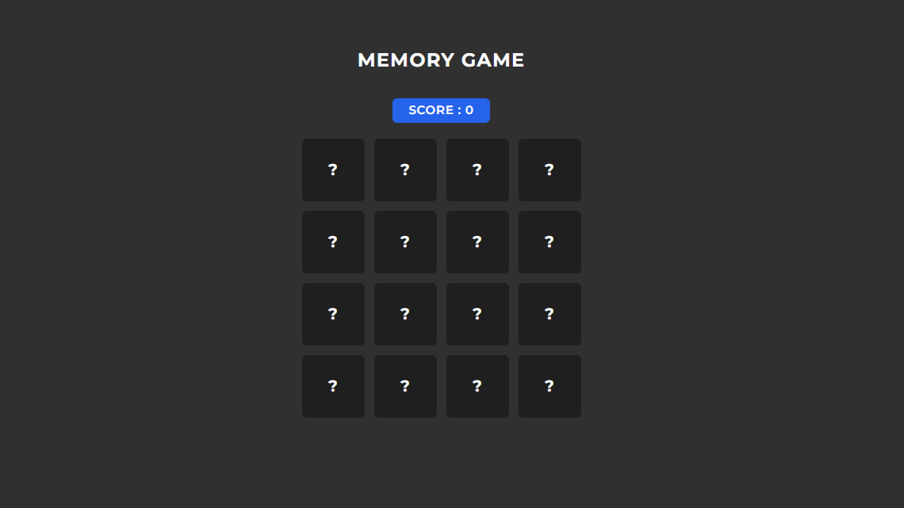

# Memory Card Game

A React-based memory card matching game with customizable settings and interactive gameplay.



## 🎮 Demo
[Live Demo](https://memory-game-ednfp9caj-nilesh211807s-projects.vercel.app/)

## ✨ Features

- Dynamic grid sizing (2x2 up to 10x10)
- Customizable move limits
- Score tracking system
- Responsive design for all devices
- Interactive card flipping animations
- Win/lose state management
- Game settings customization

## 🛠️ Tech Stack

- React.js
- Tailwind CSS
- Context API
- Vite
- ESLint

## 📥 Installation

### Prerequisites
- Node.js (v14+)
- npm (v6+)

### Setup Steps
```sh
# Clone repository
git clone https://github.com/NILESH211807/Memory-Game.git

# Navigate to project
cd Memory-Game

# Install dependencies
npm install

# Start development server
npm run dev

 # Build for production
npm run build   

# Preview build
npm run preview  
